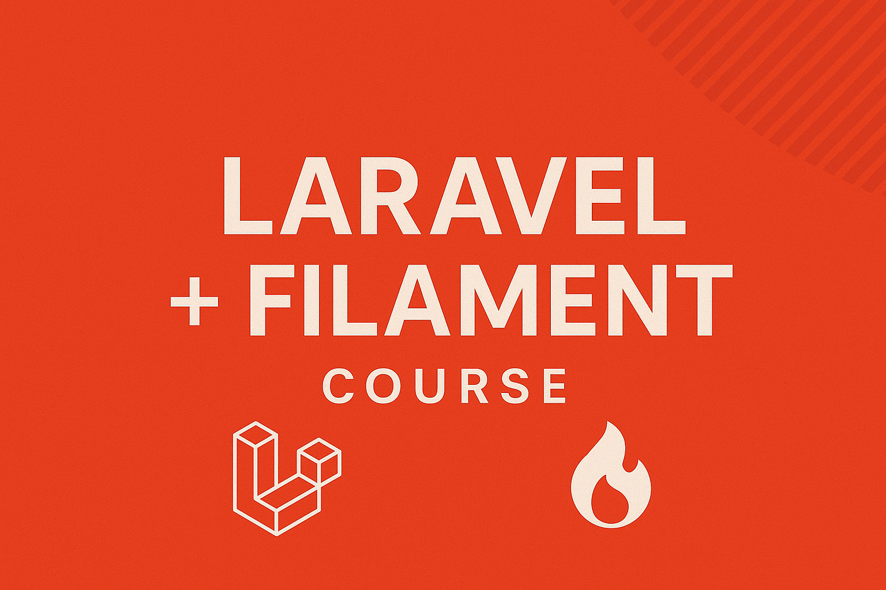

# หลักสูตรการสอน Laravel + Filament (4 วัน)

---

## Day 1 – พื้นฐานเว็บ และ PHP เบื้องต้น (6 ชม.)

### Section 1: ภาพรวมเว็บแอปพลิเคชัน
- Web ทำงานอย่างไร (Client–Server, HTTP Request/Response)
- Frontend vs Backend
- Role ของ HTML, CSS, JS, PHP
- แนะนำ Laravel และ Filament ว่าเป็นอะไร และใช้ทำอะไร

### Section 2: HTML / CSS พื้นฐาน
- โครงสร้าง HTML (tag, attribute, nesting)
- Form และ Input พื้นฐาน
- Table, Image, Link
- CSS selector, class, id
- Layout (flex/grid)
- **Mini Workshop:** ทำหน้า Form + Table แสดงข้อมูล mock

### Section 3: JavaScript เบื้องต้น
- การแทรก JS ใน HTML
- ตัวแปร, if/else, loop
- DOM manipulation (`document.getElementById`, `querySelector`)
- Event (`onClick`, `onChange`)
- **Mini Workshop:** เขียน script ตรวจสอบฟอร์ม

### Section 4: PHP เบื้องต้น
- PHP syntax: ตัวแปร, array, if/else, loop, function
- การรับค่า `$_GET` / `$_POST`
- การ include / require
- **Mini Workshop:** เขียนฟอร์มส่งค่า PHP และประมวลผล

---

## Day 2 – Database + SQL + PHP กับ MySQL (6 ชม.)

### Section 5: พื้นฐานฐานข้อมูล
- RDBMS คืออะไร
- Entity, Attribute, Relation
- Primary Key, Foreign Key
- Normalization เบื้องต้น
- ออกแบบ ER Diagram (ตัวอย่างระบบยืมคืนอุปกรณ์)

### Section 6: SQL พื้นฐาน
- `SELECT`, `WHERE`, `ORDER BY`, `LIMIT`
- `INSERT`, `UPDATE`, `DELETE`
- การ JOIN ข้ามหลายตาราง (`INNER JOIN`, `LEFT JOIN`)
- การใช้ Aggregate (`COUNT`, `SUM`, `GROUP BY`, `HAVING`)
- **Mini Workshop:** สร้างตาราง + Query ข้อมูล

### Section 7: PHP + MySQL
- การเชื่อมต่อ MySQL ด้วย PDO
- การรัน query และ loop แสดงผล
- Prepared Statement
- **Mini Workshop:** CRUD ง่าย ๆ ด้วย PHP + MySQL

---

## Day 3 – Laravel 11 พื้นฐาน (6 ชม.)

### Section 8: ติดตั้งและโครงสร้างโปรเจกต์ Laravel
- ติดตั้ง PHP 8.2, Composer
- สร้างโปรเจกต์ Laravel 11
- โครงสร้างไฟล์และ MVC

### Section 9: Routing & Controller
- Route พื้นฐาน (GET, POST)
- การส่งข้อมูลไป View
- Route Group, Middleware เบื้องต้น
- **Mini Workshop:** สร้างหน้า “สินค้า” ด้วย Route + Controller + View

### Section 10: Model & Migration
- การสร้าง Migration + Run
- การสร้าง Model และความสัมพันธ์ (1–Many, Many–Many)
- **Mini Workshop:** ออกแบบตารางจาก ER Diagram แล้ว Migration

### Section 11: Blade Template
- Layout, section, yield
- `@foreach`, `@if`
- การแสดงข้อมูลจาก Controller
- **Mini Workshop:** แสดงรายการข้อมูลจากฐานข้อมูล

---

## Day 4 – Filament 3 + Workshop สุดท้าย (6 ชม.)

### Section 12: ติดตั้งและใช้ Filament
- ติดตั้ง Filament 3
- สร้าง User Login (ใช้ Laravel Breeze / Fortify)
- การสร้าง Resource (CRUD auto)
- การกำหนด Field, Column
- การจัดการ Relation ใน Filament

### Section 13: Role & Permission
- ติดตั้ง Spatie Laravel Permission
- กำหนด Role (Admin, User)
- Restrict การเข้าถึงเมนูใน Filament

### Section 14: Workshop สุดท้าย
**หัวข้อ:** ระบบยืมคืนอุปกรณ์ (Borrow System)  
ฟีเจอร์:
- Admin จัดการประเภทอุปกรณ์, อุปกรณ์
- User ยืม/คืน
- รายงานประวัติการยืม–คืน  
ขั้นตอน:
1. สร้าง ER Diagram
2. Migration
3. Model
4. Filament Resource
5. ทดสอบระบบครบวงจร

### Section 15: สร้าง API Service 
- Auth
- จัดการหมวดหมู่
- จัดการอุปกรณ์
- บันทึกยืม/คืน

### Section 16: สรุปและต่อยอด
- แนะนำการ Deploy
- แหล่งเรียนรู้ต่อ
