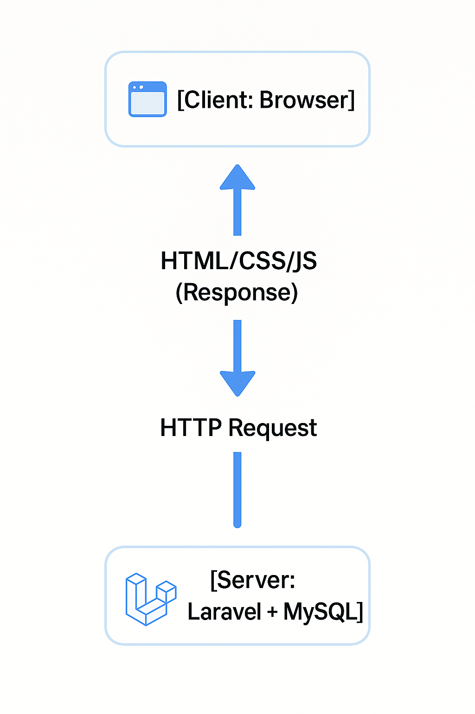
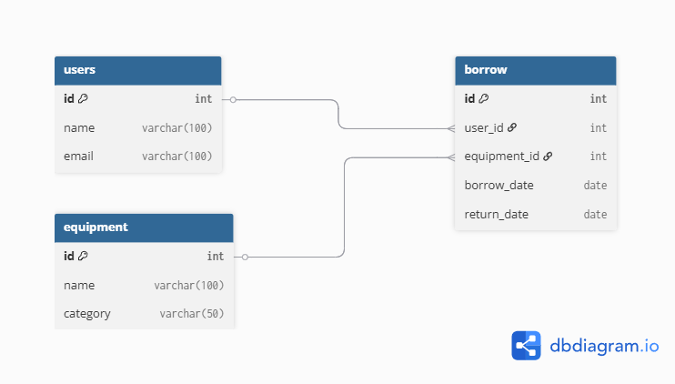

# Section 1 – ภาพรวมเว็บแอปพลิเคชัน (Web Application Overview)

## 🎯 เป้าหมายการเรียนรู้

- เข้าใจว่าเว็บแอปพลิเคชันทำงานอย่างไร (Client–Server)
- รู้จักส่วนประกอบหลัก (Frontend / Backend / Database)
- เข้าใจบทบาท HTML, CSS, JS, PHP
- เห็นภาพว่า Laravel และ Filament เข้ามาอยู่ตรงไหนในภาพรวม

---

## Step 1 – Web Application คืออะไร
**เว็บแอปพลิเคชัน** คือ โปรแกรมที่ทำงานบนเว็บบราวเซอร์ (Chrome, Edge, Firefox, Safari ฯลฯ) โดยมีการสื่อสารกับเซิร์ฟเวอร์ผ่านอินเทอร์เน็ตหรือเครือข่ายภายใน (LAN)

**โครงสร้างพื้นฐาน**
```
[ผู้ใช้/Browser] → ส่ง Request → [Web Server] → ประมวลผล → ส่ง Response กลับ
```
**ตัวอย่างการทำงาน**
1. ผู้ใช้พิมพ์ URL หรือกดปุ่มในเว็บ (Browser)
2. Browser ส่ง HTTP Request ไปยัง Server
3. Server ประมวลผล (เช่น PHP อ่านข้อมูลจาก Database)
4. Server ส่ง HTML/CSS/JS กลับไปให้ Browser แสดงผล

---

## Step 2 – Client–Server Model
💡 **Client (ฝั่งผู้ใช้)**  
- อุปกรณ์ที่ใช้เข้าถึงเว็บ (PC, Mobile)
- ทำงานด้วย HTML + CSS + JS

💡 **Server (ฝั่งประมวลผล)**  
- รัน PHP / Laravel
- เชื่อมต่อฐานข้อมูล (MySQL, PostgreSQL ฯลฯ)
- ตอบสนองข้อมูลในรูปแบบ HTML, JSON

**ภาพประกอบ**




---

## Step 3 – ส่วนประกอบหลักของเว็บ

| ส่วน        | ทำงานบน  | ภาษาหรือเทคโนโลยี       |
|-------------|----------|--------------------------|
| Frontend    | Browser  | HTML, CSS, JavaScript    |
| Backend     | Server   | PHP, Laravel             |
| Database    | Server   | MySQL, MariaDB           |

---

## Step 4 – บทบาทของ HTML, CSS, JS, PHP
- **HTML** → สร้างโครงสร้างเนื้อหา (Structure)
- **CSS** → จัดรูปแบบ (Style)
- **JavaScript** → เพิ่มความโต้ตอบ (Interaction)
- **PHP** → ประมวลผลฝั่ง Server (Backend Logic)
- **MySQL** → เก็บและดึงข้อมูล
- **Laravel** → PHP Framework ช่วยจัดโครงสร้างโค้ด PHP ให้เป็นระบบ
- **Filament** → เครื่องมือสร้างหน้าจอ Admin CRUD ได้รวดเร็ว

---

## Step 5 – Mini Workshop
**หัวข้อ:** จำลองการส่ง Request/Response

**โจทย์:**  
ให้นักศึกษาเปิด Notepad หรือ VS Code เขียน HTML ง่าย ๆ แล้วเปิดใน Browser

```html
<!DOCTYPE html>
<html>
<head>
    <title>My First Web</title>
</head>
<body>
    <h1>สวัสดี Laravel!</h1>
    <p>นี่คือเว็บเพจแรกของคุณ</p>
</body>
</html>
```


# Section 2 – HTML / CSS พื้นฐาน

## 🎯 เป้าหมายการเรียนรู้

1. เข้าใจโครงสร้างของ HTML
2. ใช้ Tag พื้นฐานได้ (heading, paragraph, image, table, form)
3. จัดรูปแบบเว็บด้วย CSS (สี, ฟอนต์, layout)
4. เตรียมพื้นฐานสำหรับต่อยอดไปทำ Laravel View

---

## Step 1 – HTML คืออะไร
- **HTML** = HyperText Markup Language  
- ใช้กำหนด **โครงสร้างเนื้อหา** (Content Structure) ของเว็บ  
- ประกอบด้วย Tag เช่น `<h1>`, `<p>`, ``, `<table>`

**โครงสร้าง HTML พื้นฐาน**
```html
<!DOCTYPE html>
<html>
<head>
    <title>ชื่อเว็บเพจ</title>
</head>
<body>
    เนื้อหาอยู่ในนี้
</body>
</html>
```

## Step 2 – Tag พื้นฐาน

| Tag              | ความหมาย       | ตัวอย่าง |
|------------------|----------------|----------|
| `<h1>` ถึง `<h6>` | หัวข้อ         | `<h1>หัวข้อใหญ่</h1>` |
| `<p>`            | ย่อหน้า        | `<p>นี่คือย่อหน้า</p>` |
| `<a>`            | ลิงก์          | `<a href="https://laravel.com">ไป Laravel</a>` |
| ``          | รูปภาพ         | `` |
| `<table>`        | ตาราง          | `<table><tr><td>ข้อมูล</td></tr></table>` |
| `<form>`         | ฟอร์มส่งข้อมูล | `<form action="save.php" method="post">...</form>` |

## Step 3 – ตัวอย่าง HTML เบื้องต้น

```html
<!DOCTYPE html>
<html>
<head>
    <title>My First HTML</title>
</head>
<body>
    <h1>สวัสดี HTML</h1>
    <p>นี่คือย่อหน้าแรกของเว็บเพจ</p>
    <a href="https://laravel.com" target="_blank">ไปยัง Laravel</a>
    <hr>
    
</body>
</html>
```

## Step 4 – CSS คืออะไร

- **CSS** = Cascading Style Sheets  
- ใช้กำหนดลักษณะการแสดงผล เช่น **สี**, **ขนาดตัวอักษร**, **การจัดวาง**

### วิธีเชื่อม CSS
1. **Inline** → ใน tag โดยตรง  
   ตัวอย่าง: `<h1 style="color:red;">`
2. **Internal** → ใน `<style>` ภายในไฟล์ HTML
3. **External** → แยกไฟล์ `.css` แล้วใช้ `<link>`

---

## Step 5 – ตัวอย่าง CSS พื้นฐาน

```html
<!DOCTYPE html>
<html>
<head>
    <title>CSS Example</title>
    <style>
        body {
            background-color: #f4f4f4;
            font-family: Arial, sans-serif;
        }
        h1 {
            color: #45BC25;
        }
        p {
            font-size: 18px;
            color: #333;
        }
        .highlight {
            background-color: yellow;
        }
    </style>
</head>
<body>
    <h1>สวัสดี CSS</h1>
    <p class="highlight">ข้อความนี้มีพื้นหลังสีเหลือง</p>
</body>
</html>
```

## Step 6 – Layout เบื้องต้นด้วย CSS

- ใช้ **Flexbox** หรือ **Grid** ในการจัดวาง Layout

### ตัวอย่าง Flexbox
```html
<style>
.container {
    display: flex;
    gap: 10px;
}
.box {
    background: lightblue;
    padding: 20px;
    flex: 1;
}
</style>

<div class="container">
    <div class="box">กล่องที่ 1</div>
    <div class="box">กล่องที่ 2</div>
</div>
```
## Step 7 – Mini Workshop

**โจทย์:**  
ให้นักศึกษาออกแบบหน้า **“บัตรข้อมูลนักศึกษา” (Student Card)** ด้วย HTML + CSS  
- มีชื่อ, รหัสนักศึกษา, รูปภาพ, ข้อมูลติดต่อ
- จัดให้สวยงามด้วย CSS (สี, ขอบ, เงา)

### ตัวอย่าง
```html
<style>
.card {
    border: 1px solid #ddd;
    padding: 20px;
    width: 300px;
    box-shadow: 2px 2px 5px #aaa;
    border-radius: 8px;
    background: #fff;
}
.card img {
    width: 100%;
    border-radius: 8px;
}
.card h2 {
    color: #45BC25;
}
</style>

<div class="card">
    
    <h2>สมชาย ใจดี</h2>
    <p>รหัส: 12345678</p>
    <p>Email: somchai@example.com</p>
</div>
```

## Section 3 – JavaScript พื้นฐาน

🎯 **เป้าหมายการเรียนรู้**  
1. เข้าใจบทบาทของ JavaScript ในเว็บ
2. ใช้ตัวแปร, เงื่อนไข, ลูป ได้
3. รู้จักการจัดการ DOM (Document Object Model)
4. ทำ Event Handling (จับการคลิก/พิมพ์)
5. พร้อมใช้ JavaScript ร่วมกับ Laravel Blade ในอนาคต

---

### Step 1 – JavaScript คืออะไร

**JavaScript (JS)** เป็นภาษาสคริปต์ที่ทำงานบน **Browser** (ฝั่ง Client)  
ใช้เพื่อเพิ่ม **ความโต้ตอบ (Interaction)** ให้กับเว็บ เช่น การคลิกปุ่มแล้วเปลี่ยนเนื้อหา  
ทำงานร่วมกับ **HTML/CSS** เพื่อปรับเปลี่ยนข้อมูลหรือสไตล์ได้แบบทันที (Real-time)

### Step 2 – วิธีใช้ JavaScript

1. **Inline** → ใส่ใน attribute ของ HTML  
```html
<button onclick="alert('Hello')">Click</button>
```

2. Internal → เขียนใน `<script>` ภายในไฟล์ HTML
```html
<script>
    alert("สวัสดี JS");
</script>
```
3.External → แยกไฟล์ `.js` แล้วเรียกใช้ด้วย `<script src="app.js"></script>`

---

### Step 3 – ตัวแปรและชนิดข้อมูล
```html
<script>
let name = "Somchai"; // string
let age = 20;         // number
let isStudent = true; // boolean

console.log(name, age, isStudent);
</script>
```
- ใช้ `let` หรือ `const` (ไม่ใช้ `var` ในโค้ดใหม่)
- `console.log()` ใช้ดูค่าที่ console ของ browser (กด F12 → Console)

### Step 4 – เงื่อนไข (if/else)

```html
<script>
let score = 75;

if (score >= 50) {
    console.log("ผ่าน");
} else {
    console.log("ไม่ผ่าน");
}
</script>
```
### Step 5 – ลูป (for / while)

```html
<script>
for (let i = 1; i <= 5; i++) {
    console.log("รอบที่ " + i);
}
</script>
```

### Step 6 – การเข้าถึง DOM

**DOM** = โครงสร้างของ HTML ที่ JavaScript เข้าถึงและแก้ไขได้

**ตัวอย่าง**
```html
<h1 id="title">ข้อความเดิม</h1>

<script>
document.getElementById("title").innerText = "ข้อความใหม่จาก JS";
</script>
```

### Step 7 – Event Handling

**ตัวอย่าง:** คลิกปุ่มแล้วเปลี่ยนข้อความ

```html
<h1 id="title">Hello</h1>
<button id="btn">เปลี่ยนข้อความ</button>

<script>
document.getElementById("btn").addEventListener("click", function() {
    document.getElementById("title").innerText = "เปลี่ยนแล้ว!";
});
</script>
```

### Step 8 – เปลี่ยน CSS ด้วย JS

```html
<p id="msg">ข้อความนี้จะเปลี่ยนสี</p>
<button onclick="changeColor()">เปลี่ยนสี</button>

<script>
function changeColor() {
    document.getElementById("msg").style.color = "red";
}
</script>
```

### Step 9 – Mini Workshop

**โจทย์:**  
สร้างหน้าเว็บ **ตัวนับจำนวน (Counter App)** ที่มีปุ่ม **+** และ **–** เพื่อเพิ่ม/ลดค่าตัวเลขที่แสดงบนจอ


**ตัวอย่าง**
```html
<h2 id="counter">0</h2>
<button onclick="increase()">+</button>
<button onclick="decrease()">-</button>

<script>
let count = 0;

function increase() {
    count++;
    document.getElementById("counter").innerText = count;
}

function decrease() {
    count--;
    document.getElementById("counter").innerText = count;
}
</script>
```
- ให้นักศึกษาเพิ่มการป้องกันไม่ให้ค่าติดลบ
- และลองเปลี่ยนสีตัวเลขเป็นสีเขียวเมื่อเป็นบวก, สีแดงเมื่อเป็นลบ

## Section 4 – PHP เบื้องต้น

🎯 **เป้าหมายการเรียนรู้**  

1. เข้าใจว่า PHP คืออะไรและทำงานอย่างไร
2. เขียน PHP พื้นฐานได้ (ตัวแปร, เงื่อนไข, ลูป, ฟังก์ชัน)
3. รับค่าจากฟอร์ม HTML และประมวลผลได้
4. แสดงข้อมูลแบบ Dynamic บนเว็บ
5. พร้อมต่อยอดไปทำงานกับ MySQL และ Laravel

---

### Step 1 – PHP คืออะไร

- **PHP** = *Hypertext Preprocessor*  
- เป็นภาษาสำหรับทำงานฝั่ง **Server**  
- ใช้สร้างเนื้อหา **Dynamic** เช่น:
  - ดึงข้อมูลจากฐานข้อมูล
  - ประมวลผลฟอร์ม
- ไฟล์ต้องมีนามสกุล **`.php`**
- ต้องรันผ่าน **Web Server** เช่น Apache, Nginx หรือ `php artisan serve` (ใน Laravel)

### Step 2 – โครงสร้างไฟล์ PHP

```php
<?php
// โค้ด PHP อยู่ในนี้
echo "Hello PHP!";
?>
```
- ใช้ `echo` หรือ `print` ในการแสดงผล
- สามารถผสม HTML และ PHP ได้

## Step 3 – ตัวแปรและชนิดข้อมูล

ใน PHP ตัวแปรสามารถเก็บข้อมูลได้หลายชนิด เช่น  
- **string** – เก็บข้อความ  
- **integer** – เก็บจำนวนเต็ม  
- **float** – เก็บจำนวนทศนิยม  
- **boolean** – เก็บค่าจริง (`true`) หรือเท็จ (`false`)  
- **array** – เก็บค่าหลายค่าในตัวแปรเดียว

### ตัวอย่างโค้ด

```php
<?php
// ตัวแปรพื้นฐาน
$name = "Somchai";   // string
$age = 20;           // integer
$height = 1.75;      // float
$isStudent = true;   // boolean

// การแสดงผล
echo "ชื่อ: $name อายุ: $age ปี<br>";

// ตัวแปรแบบ Array
$fruits = ["มะม่วง", "ทุเรียน", "ส้ม"];

// แสดงผล array แบบวนลูป
echo "ผลไม้ที่มี:<br>";
foreach ($fruits as $fruit) {
    echo "- $fruit<br>";
}

// Array แบบกำหนด key => value
$person = [
    "name" => "Somchai",
    "age" => 20,
    "height" => 1.75,
    "isStudent" => true
];

// แสดงผลจาก associative array
echo "<br>ข้อมูลบุคคล:<br>";
echo "ชื่อ: " . $person["name"] . "<br>";
echo "อายุ: " . $person["age"] . "<br>";
echo "ส่วนสูง: " . $person["height"] . "<br>";
echo "นักศึกษา: " . ($person["isStudent"] ? "ใช่" : "ไม่ใช่") . "<br>";
?>
```

คำอธิบาย
- ใช้ `[]` เพื่อสร้าง Indexed Array (เข้าถึงด้วยเลข index)
- ใช้ `foreach` เพื่อวนลูปอ่านค่าภายใน array

### Step 4 – เงื่อนไข (if/else)

```php
<?php
$score = 75;

if ($score >= 50) {
    echo "ผ่าน";
} else {
    echo "ไม่ผ่าน";
}
?>
```

### Step 5 – ลูป (for / foreach)

```php
<?php
for ($i = 1; $i <= 5; $i++) {
    echo "รอบที่ $i <br>";
}

$fruits = ["มะม่วง", "ทุเรียน", "ส้ม"];
foreach ($fruits as $fruit) {
    echo $fruit . "<br>";
}
?>
```

## Step 6 – ฟังก์ชัน (Function)

**ฟังก์ชัน** คือชุดคำสั่งที่รวมกันไว้เพื่อให้เรียกใช้งานซ้ำได้ ช่วยให้โค้ดสั้น กระชับ และแก้ไขได้ง่าย  
ใน PHP เราสามารถสร้างฟังก์ชันด้วยคำสั่ง `function` ตามด้วยชื่อฟังก์ชัน และสามารถส่งค่าเข้าไปเป็น **พารามิเตอร์** ได้

### ตัวอย่างโค้ด

```php
<?php
// ฟังก์ชันรับพารามิเตอร์ $name และส่งค่ากลับ
function hello($name) {
    return "สวัสดี $name";
}

// เรียกใช้งานฟังก์ชัน
echo hello("สมชาย"); // แสดงผล: สวัสดี สมชาย
?>
```

### คำอธิบาย
- `function hello($name)` คือการประกาศฟังก์ชันชื่อ hello
- ตัวแปร `$name` คือ parameter ใช้รับค่าที่ส่งเข้ามาในฟังก์ชัน
- `return` ใช้ส่งค่ากลับไปยังจุดที่เรียกฟังก์ชัน
- การเรียกใช้ฟังก์ชันใช้รูปแบบ `ชื่อฟังก์ชัน(ค่าที่ส่งเข้าไป)`

### ตัวอย่างเพิ่ม: ฟังก์ชันที่มีค่าเริ่มต้น (Default Parameter)
```php
<?php
function hello($name = "ผู้มาเยือน") {
    return "สวัสดี $name";
}

echo hello();          // แสดงผล: สวัสดี ผู้มาเยือน
echo hello("สมหญิง");  // แสดงผล: สวัสดี สมหญิง
?>
```

#### หมายเหตุ
- ชื่อฟังก์ชันต้องไม่ซ้ำกับฟังก์ชันอื่นในโปรแกรม
- PHP ไม่สนตัวพิมพ์ใหญ่–เล็กของชื่อฟังก์ชัน (case-insensitive) แต่ควรใช้รูปแบบเดียวกันเพื่อความชัดเจน

## Step 7 – รับค่าจากฟอร์ม HTML

ใน PHP เราสามารถรับข้อมูลจากฟอร์ม HTML ได้โดยใช้ตัวแปรพิเศษ (Superglobals) เช่น `$_GET` และ `$_POST`

### ตัวอย่างโค้ด
**form.html**
```html
<form action="process.php" method="post">
    ชื่อ: <input type="text" name="name">
    <button type="submit">ส่ง</button>
</form>
```
**process.php**
```php
<?php
// รับค่าจากฟอร์มที่ส่งด้วย method="post"
$name = $_POST['name'];

// แสดงผล
echo "สวัสดี $name";
?>
```
- `$_GET` ใช้รับค่าจาก URL เช่น `page.php?name=abc`
- `$_POST` ใช้รับค่าจากฟอร์มที่ส่งแบบ POST

## Step 8 – การ Include ไฟล์

ใน PHP เราสามารถนำโค้ดจากไฟล์อื่นมาใช้ซ้ำได้ โดยใช้คำสั่ง **`include`** หรือ **`require`**  
วิธีนี้ช่วยลดการเขียนโค้ดซ้ำ เช่น ส่วนหัว (Header) และส่วนท้าย (Footer) ของเว็บเพจ


### ตัวอย่างโค้ด

**header.php**
```php
<!DOCTYPE html>
<html>
<head>
    <meta charset="UTF-8">
    <title>My Website</title>
</head>
<body>
<header>
    <h1>ยินดีต้อนรับ</h1>
    <hr>
</header>
```
**footer.php**
```php
<footer>
    <hr>
    <p>ลิขสิทธิ์ &copy; 2025 My Website</p>
</footer>
</body>
</html>
```
**index.php**
```php
<?php include "header.php"; ?>

<h1>เนื้อหาหลัก</h1>
<p>นี่คือเนื้อหาของเพจ</p>

<?php include "footer.php"; ?>
```

### คำอธิบาย

- `include` – ถ้าไฟล์ไม่พบ จะเตือน (Warning) แต่โค้ดส่วนอื่นยังทำงานต่อได้
- `require` – ถ้าไฟล์ไม่พบ จะหยุดการทำงานของสคริปต์ทันที (Fatal Error)
- `include_once` / `require_once` – ใช้เมื่อต้องการให้ไฟล์ถูกเรียกเพียงครั้งเดียว เพื่อป้องกันการโหลดซ้ำ

### ตัวอย่างการใช้ require_once
```php
<?php
require_once "config.php"; // เรียกใช้ไฟล์ config เพียงครั้งเดียว
?>
```

### เหตุผลที่ใช้ include/require

- ลดการเขียนโค้ดซ้ำ (เช่น Header/Footer/Menu)
- แก้ไขส่วนที่ใช้ร่วมกันได้ง่าย (แก้เพียงไฟล์เดียวมีผลทุกหน้า)
- ทำให้โครงสร้างโค้ดชัดเจนและบำรุงรักษาง่าย

## Step 9 – Mini Workshop  
**โจทย์:**  
สร้างระบบคิดคะแนนสอบแบบง่าย  
- หน้า **form.php** → กรอกชื่อและคะแนน  
- หน้า **result.php** → ประมวลผลว่าผ่านหรือไม่ผ่าน  
- **เกณฑ์:**  
  - คะแนน ≥ 50 = ผ่าน  
  - คะแนน < 50 = ไม่ผ่าน  

---

### 1) หน้า `form.php`
```html
<form action="result.php" method="post">
    ชื่อ: <input type="text" name="name"><br>
    คะแนน: <input type="number" name="score"><br>
    <button type="submit">ประมวลผล</button>
</form>
```
### 2) หน้า `result.php`
```php
<?php
// รับค่าจากฟอร์ม
$name = $_POST['name'];
$score = $_POST['score'];

// แสดงชื่อ
echo "ชื่อ: $name <br>";

// ตรวจสอบเงื่อนไขผ่าน/ไม่ผ่าน
if ($score >= 50) {
    echo "<span style='color:green;'>ผ่าน</span>";
} else {
    echo "<span style='color:red;'>ไม่ผ่าน</span>";
}
?>
```
## Section 5 – พื้นฐานฐานข้อมูล

🎯 **เป้าหมายการเรียนรู้** 
1. เข้าใจว่าฐานข้อมูลคืออะไร และประเภทของมัน
2. เข้าใจแนวคิด **RDBMS**, **Table**, **Row**, **Column**
3. รู้จัก **Primary Key**, **Foreign Key**
4. เข้าใจการออกแบบ **ER Diagram**
5. รู้จัก **Normalization** เบื้องต้น
6. สามารถออกแบบโครงสร้างฐานข้อมูลสำหรับระบบง่าย ๆ ได้

---

### Step 1 – ฐานข้อมูลคืออะไร

**Database**: แหล่งเก็บข้อมูลอย่างมีระบบ  
- ข้อมูลถูกจัดเก็บในรูปแบบ **Table** (ตาราง)  
- แต่ละ Table จะมี **แถว** (Row / Record) และ **คอลัมน์** (Column / Field)  

**ตัวอย่าง:**

| id | name    | age |
|----|---------|-----|
| 1  | สมชาย   | 20  |
| 2  | สุภาพร  | 22  |

---

### Step 2 – ประเภทของฐานข้อมูล

1. **RDBMS** (*Relational Database Management System*)  
   - จัดเก็บข้อมูลเป็น **ตาราง** และมีความสัมพันธ์ระหว่างตาราง  
   - ตัวอย่าง: **MySQL**, **MariaDB**, **PostgreSQL**

2. **NoSQL**  
   - จัดเก็บข้อมูลในรูปแบบ **เอกสาร**, **คีย์-ค่า (Key-Value)**, หรือ **กราฟ** แทนตาราง  
   - ตัวอย่าง: **MongoDB**, **Firebase**

---

### Step 3 – โครงสร้างใน RDBMS

- **Database** → กล่องใหญ่ที่เก็บตารางทั้งหมด  
- **Table** → เก็บข้อมูลประเภทเดียวกัน เช่น `users`, `products`  
- **Row (Record)** → ข้อมูล 1 แถว  
- **Column (Field)** → ชื่อฟิลด์ เช่น `id`, `name`, `email`

---

## Step 4 – Primary Key และ Foreign Key

### 1) Primary Key (PK)
- คือคอลัมน์ (หรือชุดคอลัมน์) ที่ใช้ระบุข้อมูลแต่ละแถวในตารางให้ **ไม่ซ้ำกัน**
- ไม่เป็น `NULL`
- มักใช้เป็นรหัสเฉพาะ เช่น `id`

**ตัวอย่าง:**
```bash
users (id, name)
```
### 2) Foreign Key (FK)
- คือคอลัมน์ในตารางหนึ่ง ที่อ้างอิงไปยัง **Primary Key** ในอีกตารางหนึ่ง
- ใช้เพื่อเชื่อมความสัมพันธ์ระหว่างตาราง (Relational Database)
- ป้องกันการกรอกข้อมูลที่ไม่สอดคล้อง (Referential Integrity)

**ตัวอย่าง:**
```bash
orders (id, user_id, total_price)
```

### 3) ตัวอย่างโครงสร้างตาราง (SQL)
```sql
CREATE TABLE users (
    id INT PRIMARY KEY AUTO_INCREMENT,
    name VARCHAR(100) NOT NULL
);

CREATE TABLE orders (
    id INT PRIMARY KEY AUTO_INCREMENT,
    user_id INT NOT NULL,
    total_price DECIMAL(10,2) NOT NULL,
    FOREIGN KEY (user_id) REFERENCES users(id)
);
```

## Step 5 – ความสัมพันธ์ของตาราง (Relationship)

ในฐานข้อมูลเชิงสัมพันธ์ (Relational Database) ตารางสามารถเชื่อมโยงกันได้หลายรูปแบบ  
ความสัมพันธ์หลักมีอยู่ 3 แบบ คือ

---

### 1) One-to-One (1:1)
- **ความหมาย:** แถวหนึ่งในตาราง A เชื่อมกับได้สูงสุดหนึ่งแถวในตาราง B
- **ตัวอย่าง:** 1 ผู้ใช้ (`users`) มี 1 โปรไฟล์ (`profiles`)

**โครงสร้างตัวอย่าง**
```sql
CREATE TABLE users (
    id INT PRIMARY KEY AUTO_INCREMENT,
    name VARCHAR(100)
);

CREATE TABLE profiles (
    id INT PRIMARY KEY AUTO_INCREMENT,
    user_id INT UNIQUE, -- UNIQUE เพื่อให้ 1 user มีได้แค่ 1 profile
    bio TEXT,
    FOREIGN KEY (user_id) REFERENCES users(id)
);
```

### 2) One-to-Many (1:N)
- **ความหมาย:** แถวหนึ่งในตาราง A เชื่อมกับหลายแถวในตาราง B
- **ตัวอย่าง:** 1 ผู้ใช้ `(users)` มีหลายคำสั่งซื้อ `(orders)`

**โครงสร้างตัวอย่าง**
```sql
CREATE TABLE users (
    id INT PRIMARY KEY AUTO_INCREMENT,
    name VARCHAR(100)
);

CREATE TABLE orders (
    id INT PRIMARY KEY AUTO_INCREMENT,
    user_id INT,
    total_price DECIMAL(10,2),
    FOREIGN KEY (user_id) REFERENCES users(id)
);
```

### 3) Many-to-Many (M:N)
- **ความหมาย:** แถวหนึ่งในตาราง A เชื่อมกับหลายแถวในตาราง B และในทางกลับกัน
- **ตัวอย่าง:** นักเรียนหลายคน (`students`) เรียนได้หลายวิชา (`subjects`)

**โครงสร้างตัวอย่าง**
```sql
CREATE TABLE students (
    id INT PRIMARY KEY AUTO_INCREMENT,
    name VARCHAR(100)
);

CREATE TABLE subjects (
    id INT PRIMARY KEY AUTO_INCREMENT,
    title VARCHAR(100)
);

-- ตารางกลาง
CREATE TABLE student_subject (
    student_id INT,
    subject_id INT,
    PRIMARY KEY (student_id, subject_id),
    FOREIGN KEY (student_id) REFERENCES students(id),
    FOREIGN KEY (subject_id) REFERENCES subjects(id)
);

```

### สรุปความแตกต่างของประเภทความสัมพันธ์ในฐานข้อมูล

| ประเภทความสัมพันธ์ | ตัวอย่าง                               | การใช้ PK/FK                      |
|---------------------|----------------------------------------|------------------------------------|
| One-to-One          | 1 ผู้ใช้ มี 1 โปรไฟล์                  | FK + UNIQUE                       |
| One-to-Many         | 1 ผู้ใช้ มีหลายคำสั่งซื้อ               | FK                                 |
| Many-to-Many        | นักเรียนหลายคน เรียนหลายวิชา           | ใช้ตารางกลาง + PK ซ้อน            |

## Step 6 – ER Diagram (Entity Relationship Diagram)

**ER Diagram** คือแผนภาพที่ใช้แสดงความสัมพันธ์ (Relationship) ระหว่างข้อมูลในระบบฐานข้อมูล  
ช่วยให้เข้าใจโครงสร้างและความเชื่อมโยงของตารางได้ง่ายขึ้น

---

### ตัวอย่าง: ระบบยืม–คืนอุปกรณ์
```
User ───< Borrow >─── Equipment
```

- **User**: เก็บข้อมูลผู้ยืม เช่น `id`, `name`, `email`
- **Equipment**: เก็บข้อมูลอุปกรณ์ เช่น `id`, `name`, `category`
- **Borrow**: บันทึกการยืม–คืน  
  เช่น `id`, `user_id`, `equipment_id`, `borrow_date`, `return_date`

### โครงสร้างตาราง (ตัวอย่าง SQL)
```sql
CREATE TABLE users (
    id INT PRIMARY KEY AUTO_INCREMENT,
    name VARCHAR(100),
    email VARCHAR(100)
);

CREATE TABLE equipment (
    id INT PRIMARY KEY AUTO_INCREMENT,
    name VARCHAR(100),
    category VARCHAR(50)
);

CREATE TABLE borrow (
    id INT PRIMARY KEY AUTO_INCREMENT,
    user_id INT,
    equipment_id INT,
    borrow_date DATE,
    return_date DATE,
    FOREIGN KEY (user_id) REFERENCES users(id),
    FOREIGN KEY (equipment_id) REFERENCES equipment(id)
);
```

### ความสัมพันธ์
- User 1 คน สามารถยืมอุปกรณ์ได้หลายครั้ง → ความสัมพันธ์ One-to-Many ระหว่าง `users` และ `borrow`
- Equipment 1 ชิ้น สามารถถูกยืมได้หลายครั้ง → ความสัมพันธ์ One-to-Many ระหว่าง `equipment` และ `borrow`
- ตาราง `borrow` เป็น ตารางกลาง ที่เชื่อมความสัมพันธ์ของผู้ใช้และอุปกรณ์

### ER Diagram


<a href="https://dbdiagram.io/d/ER_Sample_Borrow-689f2ad01d75ee360ac0210c" target="_blank">dbdiagram.io</a>

## Step 7 – Normalization เบื้องต้น

**Normalization** คือกระบวนการจัดโครงสร้างฐานข้อมูลเพื่อลดความซ้ำซ้อนของข้อมูล  
และช่วยให้การบำรุงรักษาฐานข้อมูลทำได้ง่ายขึ้น

---

### เป้าหมายหลัก
- ลดการซ้ำซ้อนของข้อมูล (Data Redundancy)
- ป้องกันความไม่สอดคล้องของข้อมูล (Data Inconsistency)
- แยกข้อมูลออกเป็นตารางย่อยตามความเกี่ยวข้อง

---

### ตัวอย่าง

#### ก่อนทำ Normalization
| id | name    | equipment1 | equipment2 |
|----|---------|------------|------------|
| 1  | สมชาย | Laptop     | Mouse      |
| 2  | สุดา    | Projector  | Laptop     |
| 2  | สมหญิง    | Projector  | Mouse     |

ปัญหา:
- มีความซ้ำซ้อน เช่น "Laptop" ปรากฏหลายครั้ง
- ถ้าต้องการเพิ่มอุปกรณ์ใหม่ ต้องเพิ่มคอลัมน์ใหม่
- การค้นหา/จัดการข้อมูลทำได้ยาก

#### หลังทำ Normalization
**ตาราง users**
| id | name    |
|----|---------|
| 1  | Somchai |
| 2  | Suda    |

**ตาราง equipment**
| id | name      |
|----|-----------|
| 1  | Laptop    |
| 2  | Mouse     |
| 3  | Projector |

**ตาราง borrow**
| id | user_id | equipment_id | borrow_date |
|----|---------|--------------|-------------|
| 1  | 1       | 1            | 2025-08-15  |
| 2  | 1       | 2            | 2025-08-15  |
| 3  | 2       | 3            | 2025-08-15  |
| 4  | 2       | 1            | 2025-08-15  |

---

### ข้อดีหลังทำ Normalization
- ลดการซ้ำซ้อนของข้อมูล
- ขยายระบบได้ง่าย (เพิ่มอุปกรณ์โดยไม่ต้องแก้โครงสร้างตาราง)
- ค้นหา/จัดการข้อมูลได้มีประสิทธิภาพมากขึ้น

---

### หมายเหตุ
การทำ Normalization มีหลายระดับ (Normal Forms: 1NF, 2NF, 3NF ฯลฯ)  
ในตัวอย่างนี้เป็นเพียงแนวคิดพื้นฐานเพื่อแยกข้อมูลออกเป็นตารางตามประเภทข้อมูล

## Step 8 – Mini Workshop
### โจทย์:
ออกแบบฐานข้อมูลระบบคำสั่งซื้อ (Order System)
- มีลูกค้า (Customer)
- มีสินค้า (Product)
- คำสั่งซื้อ (Order) มีหลายสินค้า
- แต่ละสินค้ามี **ราคา** และ **จำนวน** ในแต่ละคำสั่งซื้อ

```bash
customers (id, name, phone)
products (id, name, price)
orders (id, customer_id, order_date)
order_items (id, order_id, product_id, quantity)
```

### สิ่งที่ต้องทำ:
1. รายชื่อตาราง
2. คอลัมน์ในแต่ละตาราง
3. ความสัมพันธ์ (PK, FK)
4. ER Diagram

<a href="https://dbdiagram.io/d/ER_Sample_Order-689f2fa01d75ee360ac0a0cf" target="_blank">dbdiagram.io</a>

## Section 6 – SQL พื้นฐาน

🎯 **เป้าหมายการเรียนรู้**  
1. เขียนคำสั่งพื้นฐาน **SELECT, INSERT, UPDATE, DELETE**
2. ใช้เงื่อนไข **WHERE**, จัดเรียง **ORDER BY**, และจำกัดผลลัพธ์ **LIMIT**
3. ใช้ **Aggregate Functions** (เช่น `COUNT`, `SUM`, `AVG`, `MIN`, `MAX`)
4. ใช้ **JOIN** เพื่อดึงข้อมูลจากหลายตาราง
5. ต่อไปประยุกต์ใช้กับ **Laravel Eloquent / Query Builder**

### Step 1 – SQL คืออะไร

**SQL** (*Structured Query Language*) คือภาษาสำหรับจัดการฐานข้อมูล  
ใช้ในระบบ **RDBMS** เช่น **MySQL**, **MariaDB**, **PostgreSQL**

แบ่งเป็น 2 ส่วนหลัก:

1. **DDL (Data Definition Language)** → จัดการโครงสร้างฐานข้อมูล  
   เช่น `CREATE`, `ALTER`, `DROP`
2. **DML (Data Manipulation Language)** → จัดการข้อมูล  
   เช่น `SELECT`, `INSERT`, `UPDATE`, `DELETE`


### Step 2 – SELECT (ดึงข้อมูล)

```sql
SELECT * FROM customers;
SELECT id, name, phone FROM customers;
```

- `*` คือการดึงทุกคอลัมน์
- สามารถระบุชื่อคอลัมน์เพื่อดึงเฉพาะข้อมูลที่ต้องการ

## Step 3 – WHERE (เงื่อนไข)

คำสั่ง `WHERE` ใช้กำหนดเงื่อนไขในการดึงแถวที่ต้องการจากตาราง

### ตัวอย่างพื้นฐาน
```sql
-- เท่ากับ
SELECT * FROM customers WHERE id = 1;

-- ค้นหาบางส่วนของข้อความ (LIKE + %)
SELECT * FROM customers WHERE name LIKE '%สม%';

-- มากกว่าหรือเท่ากับ
SELECT * FROM products WHERE price >= 100;
```

ใช้ LIKE ร่วมกับไวลด์การ์ด:
- `%` แทนตัวอักษรจำนวนใดก็ได้ (ศูนย์ตัวขึ้นไป)
- `_` แทนตัวอักษร 1 ตัว
ตัวอย่าง: `name LIKE 'ส_ม%'` (ขึ้นต้นด้วย “ส”, ถัดมา 1 ตัว, ต่อด้วย “ม”, แล้วอะไรก็ได้)

### ตัวดำเนินการที่พบบ่อย
```sql
=   <>   >   >=   <   <=        -- เปรียบเทียบค่า
LIKE  NOT LIKE                  -- จับคู่รูปแบบข้อความ
IN (...)  NOT IN (...)          -- อยู่ใน/ไม่อยู่ในชุดค่า
BETWEEN a AND b                  -- อยู่ในช่วง (รวมขอบ)
IS NULL  IS NOT NULL            -- ค่าว่าง/ไม่ว่าง
```

#### ตัวอย่าง:
```sql
-- หลายเงื่อนไข
SELECT * FROM orders
WHERE customer_id = 10 AND status = 'paid';

-- ใช้ OR (ควรวงเล็บเมื่อมีหลายเงื่อนไข)
SELECT * FROM customers
WHERE (name LIKE '%สม%' OR phone LIKE '%089%')
  AND active = 1;

-- IN
SELECT * FROM products
WHERE category_id IN (1, 3, 5);

-- BETWEEN (รวม 100 และ 500)
SELECT * FROM products
WHERE price BETWEEN 100 AND 500;

-- ตรวจค่าว่าง
SELECT * FROM customers
WHERE email IS NULL;
```

#### เปรียบเทียบวันที่/เวลา
```sql
-- สั่งซื้อวันนี้
SELECT * FROM orders
WHERE DATE(order_date) = '2025-08-15';

-- ช่วงวันที่
SELECT * FROM orders
WHERE order_date >= '2025-08-01'
  AND order_date <  '2025-09-01';
```

## Step 4 – ORDER BY / LIMIT

`ORDER BY` ใช้จัดเรียงผลลัพธ์ และ `LIMIT` ใช้จำกัดจำนวนแถวที่ดึงออกมา

### ตัวอย่างพื้นฐาน
```sql
-- ราคา จากมากไปน้อย
SELECT * FROM products ORDER BY price DESC;

-- ชื่อ จากน้อยไปมาก (A→Z) และเอาแค่ 5 แถว
SELECT * FROM products ORDER BY name ASC LIMIT 5;
```
- ASC = น้อย→มาก, DESC = มาก→น้อย

#### จัดเรียงหลายคอลัมน์ (tie-breaker)
```sql
-- เรียงตามราคา (มาก→น้อย) แล้วค่อยเรียงตามชื่อ (น้อย→มาก)
SELECT * FROM products
ORDER BY price DESC, name ASC;
```

#### จัดเรียงด้วยนิพจน์/คำนวณ
```sql
-- เรียงตามมูลค่ารวม (price * quantity)
SELECT product_id, price, quantity
FROM order_items
ORDER BY (price * quantity) DESC;
```

#### LIMIT สำหรับการแบ่งหน้า (Pagination)
```sql
-- ดึง 10 แถวแรก
SELECT * FROM products ORDER BY id ASC LIMIT 10;

-- ข้าม 10 แถวแรก แล้วดึง 10 แถวถัดไป (หน้า 2, ขนาดหน้า 10)
SELECT * FROM products ORDER BY id ASC LIMIT 10 OFFSET 10;

-- รูปแบบ MySQL ทางลัด (offset, count)
SELECT * FROM products ORDER BY id ASC LIMIT 10, 10;
```

#### จัดการค่า NULL ให้อยู่ท้าย/บน
```sql
-- เอา NULL ไปท้ายสุดเสมอ
SELECT * FROM customers
ORDER BY (email IS NULL), email ASC;

-- เอา NULL ไว้ก่อน (กลับเงื่อนไข)
SELECT * FROM customers
ORDER BY (email IS NOT NULL), email ASC;
```

### หมายเหตุสำคัญ

- ถ้า ไม่ใส่ ORDER BY ลำดับผลลัพธ์ ไม่การันตี
- การ sort ชุดข้อมูลใหญ่ๆ อาจช้า: ช่วยได้ด้วย index บนคอลัมน์ที่ใช้ ORDER BY

## Step 5 – INSERT (เพิ่มข้อมูล)

ใช้ `INSERT` เพื่อเพิ่มแถวใหม่ลงในตาราง

### ตัวอย่างพื้นฐาน
```sql
INSERT INTO customers (name, phone)
VALUES ('สมชาย', '0812345678');
```
ใส่หลายแถวในคำสั่งเดียว
```sql
INSERT INTO customers (name, phone)
VALUES ('สมหญิง', '0890000001'),
       ('ประวิทย์', '0890000002');
```
ใช้ค่าเริ่มต้น/คอลัมน์อัตโนมัติ
- ถ้ามี id แบบ AUTO_INCREMENT ไม่ต้องระบุ
- ใส่วันที่ตอนนี้
```sql
INSERT INTO orders (customer_id, order_date, status)
VALUES (1, NOW(), 'pending');
```

## Step 6 – UPDATE (แก้ไขข้อมูล)

ใช้ `UPDATE` เพื่อแก้ไขข้อมูลในตาราง **อย่าลืมใส่ `WHERE`** เพื่อจำกัดแถวที่จะแก้ไข

### ตัวอย่างพื้นฐาน
```sql
-- แก้ไขเบอร์โทรของลูกค้าที่ id = 1
UPDATE customers
SET phone = '0999999999'
WHERE id = 1;
```
แก้ไขหลายคอลัมน์พร้อมกัน
```sql
UPDATE customers
SET name = 'สมชาย ใจดี', phone = '0811111111'
WHERE id = 1;
```
เงื่อนไขแบบต่าง ๆ
```sql
-- ใช้ LIKE
UPDATE customers
SET phone = '0800000000'
WHERE name LIKE '%สม%';

-- ใช้ IN
UPDATE products
SET price = price * 1.05  -- ปรับขึ้น 5%
WHERE id IN (2, 5, 7);

-- ใช้ BETWEEN
UPDATE products
SET price = price - 10
WHERE price BETWEEN 100 AND 200;
```

ใช้ทรานแซกชันเพื่อความปลอดภัย
```sql
START TRANSACTION;

UPDATE orders
SET status = 'canceled', updated_at = NOW()
WHERE id = 123 AND status = 'pending';

-- ตรวจสอบผลแล้วค่อยยืนยัน
COMMIT;
-- หรือยกเลิก
-- ROLLBACK;
```

## Step 7 – DELETE (ลบข้อมูล)

ใช้ `DELETE` เพื่อลบแถวออกจากตาราง  
> ⚠️ **ต้องมี `WHERE` เสมอ** ถ้าไม่ใส่จะลบ **ทุกแถว**

### ตัวอย่างพื้นฐาน
```sql
DELETE FROM customers
WHERE id = 2;
```
เงื่อนไขลบแบบต่าง ๆ
```sql
-- ลบด้วย LIKE
DELETE FROM customers
WHERE name LIKE 'ทดสอบ%';

-- ลบหลายค่า
DELETE FROM products
WHERE id IN (5, 7, 9);

-- ลบตามช่วงราคา
DELETE FROM products
WHERE price BETWEEN 0 AND 50;
```
ลบด้วย Subquery
```sql
-- ลบออเดอร์ของลูกค้า id = 10
DELETE FROM orders
WHERE customer_id = 10;

-- ลบ items ของออเดอร์ที่ถูกยกเลิก
DELETE FROM order_items
WHERE order_id IN (
  SELECT id FROM orders WHERE status = 'canceled'
);
```
ลบด้วย JOIN (MySQL)
```sql
-- ลบ order_items ที่ออเดอร์ถูกยกเลิก
DELETE oi
FROM order_items oi
JOIN orders o ON o.id = oi.order_id
WHERE o.status = 'canceled';
```

## Step 8 – Aggregate Functions (ฟังก์ชันรวม)

ฟังก์ชันรวมใช้สรุปผลข้อมูลหลายแถวให้เป็นค่าเดียว เช่น นับจำนวน, รวมยอด, ค่าเฉลี่ย ฯลฯ

### ตัวอย่างพื้นฐาน
```sql
-- นับจำนวนลูกค้าทั้งหมด
SELECT COUNT(*) AS total_customers FROM customers;

-- ผลรวมราคาในตารางสินค้า
SELECT SUM(price) AS total_price FROM products;

-- ค่าเฉลี่ยราคา
SELECT AVG(price) AS avg_price FROM products;
```
ฟังก์ชันที่พบบ่อย
```sql
COUNT(*)          -- นับจำนวนแถวทั้งหมด (รวม NULL)
COUNT(column)     -- นับเฉพาะแถวที่ column ไม่เป็น NULL
SUM(column)       -- ผลรวม
AVG(column)       -- ค่าเฉลี่ย
MIN(column)       -- ค่าต่ำสุด
MAX(column)       -- ค่าสูงสุด
```
หมายเหตุเกี่ยวกับ NULL
- `COUNT(column)` ไม่นับ แถวที่เป็น `NULL`
- `AVG`, `SUM,` `MIN`, `MAX` จะ ไม่รวม แถว `NULL` ในการคำนวณ

## Step 9 – GROUP BY / HAVING

`GROUP BY` ใช้ **จัดกลุ่มแถว** เพื่อคำนวณสรุปต่อกลุ่ม (เช่น นับ/รวม/เฉลี่ย)  
`HAVING` ใช้ **กรองผลลัพธ์หลังจัดกลุ่มแล้ว** (ต่างจาก `WHERE` ที่กรองก่อนจัดกลุ่ม)

---

### ตัวอย่างพื้นฐาน
```sql
SELECT customer_id, COUNT(*) AS total_orders
FROM orders
GROUP BY customer_id
HAVING COUNT(*) > 5;  -- เอาเฉพาะลูกค้าที่มีออเดอร์มากกว่า 5
```
#### ความต่างระหว่าง WHERE vs HAVING
```sql
-- กรองก่อนรวม (เร็วกว่า เพราะลดจำนวนแถวก่อน)
SELECT customer_id, COUNT(*) AS total_orders
FROM orders
WHERE status = 'paid'
GROUP BY customer_id;

-- กรองหลังรวม (กรณีเงื่อนไขอิงค่าที่ถูกคำนวณแล้ว)
SELECT customer_id, COUNT(*) AS total_orders
FROM orders
GROUP BY customer_id
HAVING COUNT(*) >= 10;
```

#### จัดกลุ่มหลายคอลัมน์
```sql
-- นับออเดอร์ตาม ลูกค้า + สถานะ
SELECT customer_id, status, COUNT(*) AS cnt
FROM orders
GROUP BY customer_id, status
ORDER BY customer_id, status;
```

#### สรุปยอดขายต่อสินค้า (จาก order_items)
```sql
SELECT product_id,
       SUM(quantity)              AS qty_sold,
       SUM(price * quantity)      AS revenue
FROM order_items
GROUP BY product_id
HAVING SUM(price * quantity) > 10000   -- กรองยอดขายรวมต่อสินค้า
ORDER BY revenue DESC;
```

#### จัดกลุ่มตามวัน/เดือน
```sql
-- ต่อวัน
SELECT DATE(order_date) AS order_day,
       COUNT(*)         AS orders,
       SUM(total_amount) AS day_total
FROM orders
GROUP BY DATE(order_date)
ORDER BY order_day;

-- ต่อเดือน (MySQL)
SELECT DATE_FORMAT(order_date, '%Y-%m') AS ym,
       COUNT(*) AS orders,
       SUM(total_amount) AS month_total
FROM orders
GROUP BY DATE_FORMAT(order_date, '%Y-%m')
ORDER BY ym;
```

## Step 10 – JOIN (ดึงข้อมูลจากหลายตาราง)

`JOIN` ใช้เชื่อมข้อมูลข้ามตารางด้วยคีย์ที่เกี่ยวข้อง (เช่น PK/FK)

### โครงสร้างตัวอย่าง
- `customers(id, name)`
- `orders(id, customer_id, order_date)`

---

## 1) INNER JOIN
ดึงเฉพาะแถวที่ **จับคู่ได้ทั้งสองฝั่ง**
```sql
SELECT o.id, c.name, o.order_date
FROM orders AS o
INNER JOIN customers AS c
  ON o.customer_id = c.id;
```

## 2) LEFT JOIN
ดึง ทุกแถวฝั่งซ้าย แม้จะไม่มีคู่ (คอลัมน์ฝั่งขวาจะเป็น `NULL`)
```sql
SELECT c.name, o.id AS order_id
FROM customers AS c
LEFT JOIN orders AS o
  ON c.id = o.customer_id;
```
> สรุปสั้น INNER <br>JOIN → เอาเฉพาะที่จับคู่ได้ <br>LEFT JOIN → เอาฝั่งซ้ายทั้งหมด + คู่ที่มี (ถ้าไม่มี คู่เป็น NULL)

## 3) RIGHT / FULL OUTER JOIN (เกร็ด)
- **RIGHT JOIN**: ตรงข้าม LEFT (เอาฝั่งขวาทุกแถว) – มีใน MySQL/PG
- **FULL OUTER JOIN**: เอาทั้งสองฝั่งแม้ไม่แมตช์ – MySQL ไม่มีโดยตรง ทำได้ด้วย `LEFT JOIN ... UNION ... RIGHT JOIN ... WHERE ... IS NULL`

## 4) JOIN หลายตาราง (ตัวอย่าง Order System)
สมมุติมี `order_items(order_id, product_id, price, quantity)` และ `products(id, name)`
```sql
SELECT o.id AS order_id,
       c.name AS customer_name,
       p.name AS product_name,
       oi.quantity,
       oi.price,
       (oi.quantity * oi.price) AS line_total
FROM orders o
JOIN customers c   ON c.id = o.customer_id
JOIN order_items oi ON oi.order_id = o.id
JOIN products p     ON p.id = oi.product_id
ORDER BY o.id;
```

## 5) JOIN + GROUP BY (สรุปจำนวนออเดอร์ต่อลูกค้า)
```sql
SELECT c.id, c.name, COUNT(o.id) AS total_orders
FROM customers c
LEFT JOIN orders o ON o.customer_id = c.id
GROUP BY c.id, c.name
HAVING COUNT(o.id) > 5;
```

## 6) Anti-Join / หา “ที่ไม่มีคำสั่งซื้อ”
```sql
-- ลูกค้าที่ไม่เคยมีออเดอร์เลย
SELECT c.*
FROM customers c
LEFT JOIN orders o ON o.customer_id = c.id
WHERE o.id IS NULL;
```

### Step 11 – Mini Workshop

**โจทย์:**  
จากตาราง:  
```bash
customers (`id`, `name`, `phone`)  
orders (`id`, `customer_id`, `order_date`, `total_price`)  
```
1. เขียน SQL ดึง **ชื่อ** และ **เบอร์ลูกค้า** ทั้งหมดที่มียอดซื้อรวมมากกว่า **500 บาท**  
2. เรียงจากยอดซื้อมากไปน้อย

### Step 12 – เชื่อมโยงสู่ Laravel
- คำสั่ง `SELECT`, `INSERT`, `UPDATE`, `DELETE` จะถูกแทนด้วย Eloquent ORM หรือ Query Builder ใน Laravel
- การ `JOIN` ใน SQL จะกลายเป็น Relation (`hasMany`, `belongsTo`, `belongsToMany`)

## Section 7 – PHP + MySQL

🎯 **เป้าหมายการเรียนรู้**  
1. เชื่อมต่อ **PHP** กับ **MySQL** ได้
2. รันคำสั่ง **SQL** ผ่าน PHP ได้
3. ใช้ **Prepared Statement** เพื่อป้องกัน **SQL Injection**
4. ทำ **CRUD** (Create, Read, Update, Delete) เบื้องต้น
5. พร้อมต่อยอดไปทำ **Migration** + **Model** ใน Laravel

## Step 1 – การเชื่อมต่อฐานข้อมูล (PDO)

ใน PHP สมัยใหม่แนะนำให้ใช้ **PDO (PHP Data Objects)** เพราะรองรับหลาย DB, ใช้ Prepared Statement ได้ และจัดการข้อผิดพลาดได้ยืดหยุ่นกว่า `mysqli`.

### db.php (ฉบับแนะนำ)
```php
<?php
// ปรับค่าตามเครื่องคุณ
$host    = '127.0.0.1';
$db      = 'testdb';
$user    = 'root';
$pass    = '';
$charset = 'utf8mb4';

// สร้าง DSN (ระบุ charset ให้รองรับภาษาไทย/อีโมจิ)
$dsn = "mysql:host=$host;dbname=$db;charset=$charset";

// ตัวเลือกเพื่อความปลอดภัย/สะดวกเวลาใช้งาน
$options = [
    PDO::ATTR_ERRMODE            => PDO::ERRMODE_EXCEPTION, // โยน Exception เมื่อเกิดข้อผิดพลาด
    PDO::ATTR_DEFAULT_FETCH_MODE => PDO::FETCH_ASSOC,       // คืนข้อมูลแบบแอสโซซิเอทีฟ
    PDO::ATTR_EMULATE_PREPARES   => false,                  // ใช้ Native Prepared Statement
    // PDO::ATTR_PERSISTENT      => true,                   // (ทางเลือก) ใช้ persistent connection
];

try {
    $pdo = new PDO($dsn, $user, $pass, $options);

    // (ทางเลือก) ตั้ง timezone ให้ตรงระบบ
    // $pdo->exec("SET time_zone = '+07:00'");
} catch (PDOException $e) {
    // โปรดหลีกเลี่ยงการแสดงรายละเอียด error ต่อผู้ใช้จริงใน production
    http_response_code(500);
    exit('เชื่อมต่อฐานข้อมูลล้มเหลว');
}
```

### ตัวอย่างการใช้งาน (ทดสอบการเชื่อมต่อ)
```php
<?php
require_once __DIR__.'/db.php';

$stmt = $pdo->query("SELECT NOW() AS now_time");
$row  = $stmt->fetch();
echo "เชื่อมต่อสำเร็จ เวลาเซิร์ฟเวอร์: " . htmlspecialchars($row['now_time']);
```

### เช็กลิสต์สั้น ๆ
- เปิดส่วนขยาย `pdo_mysql` ใน PHP ให้เรียบร้อย
- ใช้ `utf8mb4` เสมอสำหรับภาษาไทย/อีโมจิ
- ซ่อนข้อความ Error จริงจากผู้ใช้ (Log ไว้แทน)
- เก็บค่า `$host/$db/$user/$pass` ไว้ในตัวแปรแวดล้อม (.env) จะปลอดภัยกว่า


## Step 2 – ดึงข้อมูล (Read)
```php
<?php
require_once 'db.php';

$sql  = "SELECT id, name, phone FROM customers ORDER BY id DESC";
$stmt = $pdo->query($sql);

while ($row = $stmt->fetch(PDO::FETCH_ASSOC)) {
    echo htmlspecialchars($row['name']) . " - " . htmlspecialchars($row['phone']) . "<br>";
}
```

## Step 3 – เพิ่มข้อมูล (Create)
```php
<?php
require_once 'db.php';

$name  = "สมชาย";
$phone = "0812345678";

$sql  = "INSERT INTO customers (name, phone) VALUES (:name, :phone)";
$stmt = $pdo->prepare($sql);
$stmt->execute(['name' => $name, 'phone' => $phone]);

echo "เพิ่มข้อมูลสำเร็จ";
```
> ใช้ `:name` และ `:phone` (Prepared Statement) → ปลอดภัยกว่า ต่อสตริงเอง

## Step 4 – แก้ไขข้อมูล (Update)
```php
<?php
include 'db.php';

$id = 1;
$newPhone = "0999999999";

$sql = "UPDATE customers SET phone = :phone WHERE id = :id";
$stmt = $pdo->prepare($sql);
$stmt->execute(['phone' => $newPhone, 'id' => $id]);

echo "แก้ไขข้อมูลสำเร็จ";
?>
```

## Step 5 – ลบข้อมูล (Delete)
```php
<?php
include 'db.php';

$id = 2;

$sql = "DELETE FROM customers WHERE id = :id";
$stmt = $pdo->prepare($sql);
$stmt->execute(['id' => $id]);

echo "ลบข้อมูลสำเร็จ";
?>
```

## Step 6 – Mini Workshop
**โจทย์:**
สร้างระบบ จัดการสินค้า (Product Management) แบบง่าย ๆ
- ตาราง products (id, name, price)
- หน้า add_product.php → กรอกชื่อและราคาสินค้า
- หน้า list_products.php → แสดงรายการสินค้าทั้งหมด
- ปุ่ม แก้ไข และ ลบ (ทำงานผ่าน PHP + PDO)

**แนวทาง**
1. สร้าง db.php → สำหรับเชื่อมต่อฐานข้อมูล
2. ทำหน้าเพิ่มสินค้า → ใช้ INSERT
3. ทำหน้ารายการสินค้า → ใช้ SELECT
4. ทำหน้าแก้ไขสินค้า → ใช้ UPDATE
5. ทำหน้าลบสินค้า → ใช้ DELETE

### Step 7 – Laravel

- ใน **Laravel** เราไม่ต้องเขียน SQL แบบดิบเองบ่อย ๆ เพราะมี **Eloquent ORM**  
- แต่การเข้าใจ **SQL** และ **PDO** จะช่วยให้เรา:
    - เขียน **Query Builder** ได้อย่างถูกต้อง
    - แก้ปัญหาได้เมื่อ **Eloquent** ไม่เพียงพอ
    - เข้าใจกลไกการทำงานของ **Laravel Migration**, **Seeder**, และ **Model**
